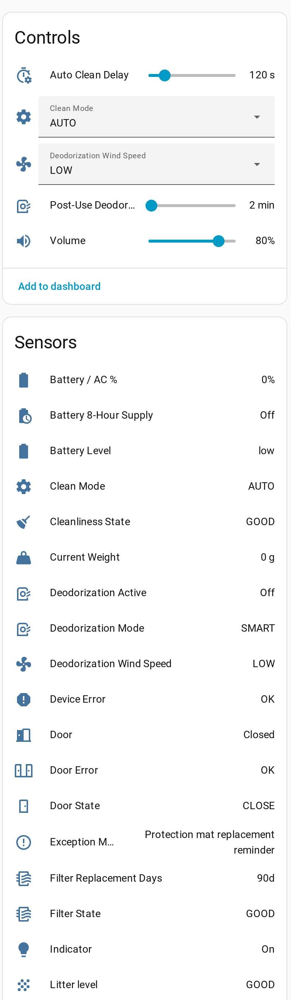

# PETLIBRO Integration for Home Assistant

[![hacs_badge][hacsbadge]][hacs] [![version][versionbadge]][versionlink]

Custom Home Assistant integration for PETLIBRO pet devices (feeders, fountains, litter boxes). Hub-based integration using the PETLIBRO cloud API, with **real-time push** over the vendor's MQTT broker and polling as a fallback.

> **Based on** [jjjonesjr33/petlibro](https://github.com/jjjonesjr33/petlibro) — this is a maintained fork with additional features, bug fixes, and audit improvements. It is kept in sync with upstream (currently through upstream v1.3, September 2026). Original credit goes to [@jjjonesjr33](https://github.com/jjjonesjr33), [@C4-Dimitri](https://github.com/C4-Dimitri), and [@FeliGoblin](https://github.com/FeliGoblin) for the foundational work.

---

## Supported Devices

### Feeders
- Granary Smart Feeder (PLAF103) — V1 & V2, including the dual-tray model's left/right food level
- Space Smart Feeder (PLAF107)
- Air Smart Feeder (PLAF108)
- Polar Wet Food Feeder (PLAF109)
- Granary Smart Camera Feeder (PLAF203)
- One RFID Smart Feeder (PLAF301)

### Fountains
- Dockstream Smart Fountain (PLWF105)
- Dockstream RFID Smart Fountain (PLWF305)
- Dockstream 2 Smart Fountain — Plug-In (PLWF106)
- Dockstream 2 Smart Fountain — Cordless (PLWF116)

### Litter Boxes
- Luma Smart Litter Box (PLLB001)

---

## Installation

### Via HACS (recommended)

1. Open HACS in Home Assistant
2. Go to **Integrations**
3. Click the three-dot menu → **Custom repositories**
4. Add `https://github.com/dn5qMDW3/petlibro` as an **Integration**
5. Install **PETLIBRO** from HACS
6. Restart Home Assistant
7. Go to **Settings → Devices & Services → Add Integration** and search for **PETLIBRO**

### Manual

1. Download the latest [release](https://github.com/dn5qMDW3/petlibro/releases) `.zip`
2. Extract `custom_components/petlibro/` into your Home Assistant `config/custom_components/` directory
3. Restart Home Assistant
4. Add the integration via **Settings → Devices & Services**

---

## Configuration

When adding the integration, enter:

- **Region** — `US` or `CN` (server region for your account)
- **Email** — your PETLIBRO account email
- **Password** — your PETLIBRO account password

To change the email or password later, use **Reconfigure** in the integration's three-dot menu, or **Configure → Change login credentials**. There is no need to remove and re-add the integration.

> **Note:** PETLIBRO only allows one active session per account, and signing in elsewhere invalidates the others. If you keep the mobile app logged in, create a separate account for Home Assistant and share your devices to it — you can accept the invitation with the `petlibro.accept_share` service.

---

## Features

- **Real-time push** — state changes arrive within about a second over PETLIBRO's MQTT broker, instead of waiting for the next poll. Polling continues in the background as a safety net (every 5 minutes while push is healthy, 60 seconds if it drops). No setup: no broker to configure and nothing to do with Home Assistant's own MQTT integration.
- Sensor entities for battery, water level, food level, weights, drinking statistics, etc.
- Switches for sound, light, child lock, deodorization, and other device toggles
- **Notification switches** — per-device alert toggles (offline, low battery, low water, filter and cleaning reminders, drinking trends, cleaning success/failure, motion and sound detection, and more), mirroring the mobile app's notification settings
- Buttons for manual feed, manual clean, lid open, timer resets, etc.
- Number inputs for volume, schedules, thresholds
- Selects for modes (clean mode, water dispensing mode, etc.)
- **Device sharing** — see pending invitations, and accept or decline them from Home Assistant
- **Litter box cleaning schedules** — view them, and add or remove them via services
- **Litter box use per pet** — today's visits, pee count and poop count on each pet, alongside the box-wide totals, plus the Luma's litter level
- **Feeding schedule control** — enable, disable, skip or delete individual feeding plans, and switch the whole schedule on or off, via services
- Firmware update notifications
- Multi-language support (14 languages)
- Account-level unit preferences (feed, water, weight)

Each entity uses a standard Home Assistant icon; the device's product picture appears on its firmware update entity.



See [docs/API_REFERENCE.md](docs/API_REFERENCE.md) for the full PETLIBRO Cloud API reference, and [docs/MQTT_RESEARCH.md](docs/MQTT_RESEARCH.md) for how the push channel works (broker, certificates, topics and payloads).

---

## Services

| Service | What it does |
|---|---|
| `petlibro.add_feeding_plan` | Add a scheduled feed to a dry food feeder |
| `petlibro.edit_feeding_plan` | Change an existing feeding plan |
| `petlibro.toggle_feeding_plan` | Enable or disable one feeding plan |
| `petlibro.skip_feeding_plan` | Skip, or un-skip, one feeding plan for today |
| `petlibro.delete_feeding_plan` | Permanently remove a feeding plan |
| `petlibro.toggle_feeding_schedule` | Enable or disable a feeder's whole schedule |
| `petlibro.toggle_today_feeding_schedule` | Enable or disable all of today's feeds |
| `petlibro.accept_share` | Accept a pending device-share invitation |
| `petlibro.decline_share` | Decline a pending device-share invitation |
| `petlibro.share_device` | Invite another PETLIBRO account to a device you own |
| `petlibro.add_clean_plan` | Add a cleaning schedule to a litter box |
| `petlibro.delete_clean_plan` | Remove a cleaning schedule from a litter box |

Pending share invitations appear on the *Pending share invitations* binary sensor, with the invitation IDs in its attributes. When only one invitation is waiting, `accept_share` and `decline_share` can be called without arguments.

---

## Pending / Experimental

- **Live camera feed** — Granary Smart Camera Feeder (PLAF203) and Luma Smart Litter Box (PLLB001) use TUTK/Kalay P2P video which isn't currently feasible to integrate directly into HA. Help welcome.

---

## Troubleshooting

### Enable debug logging

Add to `configuration.yaml`:

```yaml
logger:
  default: warning
  logs:
    custom_components.petlibro: debug
```

### Download diagnostics

**Settings → Devices & Services → PETLIBRO → ⋮ → Download diagnostics** produces a file with the raw data PETLIBRO returns for each device and pet. Serial numbers, MAC addresses, Wi-Fi names, account details, tokens and image URLs are redacted, so it is suitable for attaching to an issue — and it is the quickest way to get a missing field or a new device supported.

### First-time setup

After adding the integration, allow 1–5 minutes for all entities to populate. If entities are missing, restart Home Assistant.

### Common issues

- **Login fails** — Verify credentials and region. Code `1009` means the token expired (auto-handled). Code `1025` means a force logout (someone else logged in to the same account).
- **Devices missing** — Check your account on the PETLIBRO mobile app to confirm devices are bound. Shared devices appear with limited control.
- **Empty values** — Some devices return empty strings/null for unused fields. The integration filters these where possible.
- **Real-time push not connecting** — Check the *Real-time push* diagnostic sensor. Its attributes show the broker, the subscribed devices, the time of the last event, and the last error. Push is an optimisation: when it is unavailable the integration keeps polling, so devices still work, just less promptly.

---

## Companion Project

For a richer dashboard experience, check out [dn5qMDW3/petlibro-cards](https://github.com/dn5qMDW3/petlibro-cards) — custom Lovelace cards designed for this integration.

---

## License

GPL-3.0 — same as upstream.

---

## Acknowledgments

This integration is built on the work of:
- [@jjjonesjr33](https://github.com/jjjonesjr33) — original integration
- [@C4-Dimitri](https://github.com/C4-Dimitri) — co-developer
- [@FeliGoblin](https://github.com/FeliGoblin) — co-developer

Original repo: https://github.com/jjjonesjr33/petlibro

[hacs]: https://hacs.xyz
[hacsbadge]: https://img.shields.io/badge/HACS-Custom-black.svg?style=for-the-badge&logo=homeassistantcommunitystore&logoColor=ccc

[versionlink]: https://github.com/dn5qMDW3/petlibro/releases
[versionbadge]: https://img.shields.io/github/manifest-json/v/dn5qMDW3/petlibro?filename=custom_components%2Fpetlibro%2Fmanifest.json&color=slateblue&style=for-the-badge
